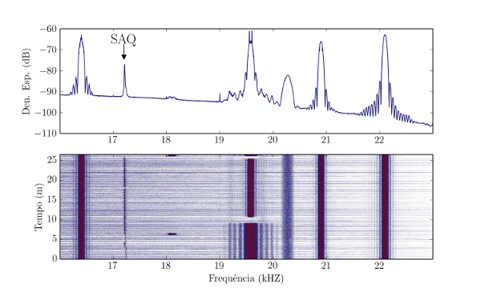

# VLF-LAB

[](https://mybinder.org/v2/gh/ricgama/VLF-LAB/master)



# Sobre

Repositório de apoio à formação: "Uma introdução à Ciência e Tecnologia em VLF"


### Setup instructions

1. First of all, clone this project to your local machine:
    ```bash
    git clone https://github.com/ricgama/VLF-LAB
    ```

2. If you don't have Anaconda already installed on your machine, click here to download [Anaconda](https://www.anaconda.com/download/) (**Python 3 version**).

3. After that, install the environment by running:
    ```bash
    cd VLF-LAB/
    conda env create --file environment.yml
    ```
4. Then activate the environment with `source activate vlf` or `conda activate vlf_lab`, and install a new `ipython` kernel by running:
    ```bash
    python -m ipykernel install --name vlf_lab
    ``` 
    If you get "Permission denied" error with the above command, try with
    ```bash
    python -m ipykernel install --name vlf_lab --user
    ``` 

5. Finally, launch the Jupyter Notebook and before starting to execute the notebook cells, ensure that the kernel is properly set to vlf_lab


